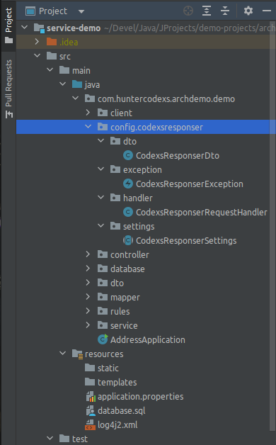

# Codexs Responser Exception Rest Handler
A small workspace for handling responses in REST requests

# License

This project is free and can be used as a basis for other projects by anyone under the MIT license.

# Languages

- Language: <a href="README.md">Portuguese Brazil (pt-br)</a> | English

# Pre Requirements

- MVC Concept
- Maven Project 4.0.0
- Spring Boot 2.0.1.RELEASE
- Java Version 1.8 (jdk1.8.0_212)

# How to use

- Dependencies

First, import the following dependencies into your project's pom.xml file:

<pre>
    &lt;dependency&gt;
        &lt;groupId>net.minidev&lt;/groupId&gt;
        &lt;artifactId>json-smart&lt;/artifactId&gt;
        &lt;version>2.3&lt;/version&gt;
        &lt;scope>compile&lt;/scope&gt;
    &lt;/dependency&gt;
</pre>

- Settings

The configuration is very simple and is done manually, to include this small workspace in any project follow
the steps below:

<pre>
git clone https://github.com/huntercodexs/codexsresponser.git
cd codexsresponser
git checkout release
rm -rf .git .gitignore
</pre>

After performing the above procedures, it is necessary to copy the files into the user project of the workspace
Codexs Responser according to the following guidelines:

NOTE

> It is recommended to do this with the help of an IDE such as IntelliJ, as this tool is capable of copying all the
> files and folders correctly renaming the "packages" and references within the project, this avoids failures
> and unexpected errors as well as causing a lot of confusion. You can just drag the entire folder into your
> project in the specified path eg src/main/java/com/projectname/project/config

The Codexs Responser workspace is not ready yet, to finish change the "package names" of the files that
make up the Codexs Responser, which are:

- CodexsResponserDto
- CodexsResponserException
- CodexsResponserRequestHandler
- CodexsResponserSettings

for example:

<pre>
package com.huntercodexs.postalcode.config.codexsresponser.dto; (CodexsResponserDto.class)
package com.huntercodexs.postalcode.config.codexsresponser.exception; (CodexsResponserException.class)
package com.huntercodexs.postalcode.config.codexsresponser.handler; (CodexsResponserRequestHandler.class)
package com.huntercodexs.postalcode.config.codexsresponser.settings; (CodexsResponserSettings.class)
</pre>

- Programming the answers

Now that the small Codexs Responser workspace is configured, it is necessary to start the code changes and
prepare the application to intercept exceptions during the processing of a request.

First edit the CodexsResponserSettings.class file as needed defining the messages and error codes
that the Codexs Responser should handle, as shown in the example below:

<pre>
1 package com.huntercodexs.archdemo.demo.config.codexsresponser.settings;
2
3 import lombok.AllArgsConstructor;
4 import lombok.Getter;
5 import lombok.NoArgsConstructor;
6 import org.springframework.http.HttpStatus;
7 import org.springframework.web.servlet.mvc.method.annotation.ResponseEntityExceptionHandler;
8
9 public abstract class CodexsResponserSettings extends ResponseEntityExceptionHandler {
10
11    /**
12     * DO NOT REMOVE THESE ATTRIBUTES AND ENUMERATOR
13     * Just change it as needed
14     * */
15
16    protected static final int unknownErrorCode = 999;
17    protected static final String unknownErrorMessage = "Unknown error";
18    protected static final String replacementString = "@{data}";
19    protected static final String missingDataMessage = "Missing Data ["+replacementString+"], please check the request";
20
21    @Getter
22    @NoArgsConstructor
23    @AllArgsConstructor
24    public enum codexsResponserExpectedErrors {
25
26        SERVICE_ERROR_ACCESS_DENIED(
27                HttpStatus.UNAUTHORIZED,
28                111,
29                "Access Denied"),
30
31        SERVICE_ERROR_NOT_FOUND(
32                HttpStatus.NOT_FOUND,
33                    120,
34                "Address not found"),
35
36        SERVICE_ERROR_RULES_NOK(
37                HttpStatus.BAD_REQUEST,
38                140,
39                "Rules is not OK"),
40
41        SERVICE_ERROR_RULES_FAIL(
42                HttpStatus.INTERNAL_SERVER_ERROR,
43                150,
45                "Rules Server Contact Failed"),
45
46        SERVICE_ERROR_TEST(
47                HttpStatus.NOT_ACCEPTABLE,
48                160,
49                "This is only a test"),
50
51        SERVICE_ERROR_INTERNAL(
52                HttpStatus.INTERNAL_SERVER_ERROR,
53                180,
54                "Internal Server Error");
55
56        public HttpStatus statusCode;
57        public int errorCode;
58        public String message;
59    }
60
61 }
</pre>

The unknownErrorCode and unknownErrorMessage attributes will be used to handle messages with exception types that
are not known to Codexs Responser.

The replacementString and missingDataMessage attributes are for exception handling coming from Validation javax
(javax.validation.Valid) whose purpose is to extract the field that is causing the error and show it in a message
custom defined in the missingDataMessage attribute. So be careful not to remove this string format
in this attribute, although it can be customized, don't forget to always insert the @{data}, either through a
"variable", either by direct code.

The codexsResponserExpectedErrors enumerator is intended to manage the error messages defined in its list,
and they will be accessed during use in the source code of the application using the Codexs Responser.

> Simulating a Codexs Responser usage

Finally, and as a demonstration, a simple rule will be presented in any code that makes use of the
Codexs Responser, it is an example with two possibilities of use and that makes clear the functionality
for other occasions.

The code below

<pre>
    if (result == null || result.getBody().getCep() == null) {
        throw new CodexsResponserException(SERVICE_ERROR_NOT_FOUND);
    }
</pre>

will produce the following response in a REST request:

<pre>
Http Status 404 (JSON)
{
    "errorCode": 404,
    "message": "Address not found"
}
</pre>

In the next code, we have an error message situation that overwrites the message configured in the error enumerator

<pre>
    if (result == null || result.getBody().getCep() == null) {
        throw new CodexsResponserException(SERVICE_ERROR_NOT_FOUND, "Data not found, please check the request");
    }
</pre>

the response in a REST request will be:

<pre>
Http Status 404 (JSON)
{
    "errorCode": 404,
    "message": "Data not found, please check the request"
}
</pre>