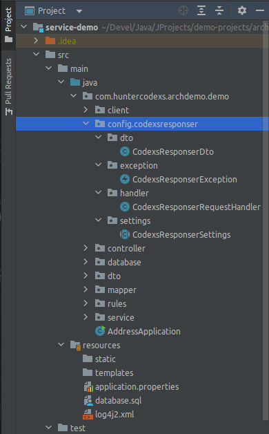

# Codexs Responser Exception Rest Handler
Um pequeno espaco de trabalho para tratamento de respostas em requisições REST

# Licença

Este projeto é livre e pode ser usado como base para outros projetos por qualquer pessoa através da licença MIT.

# Idiomas

- Language: Portugues Brazil (pt-br)  |  <a href="README-EN.md">Inglês (en)</a>

# Pre Requisitos

- MVC Concept 
- Maven Project 4.0.0 
- Spring Boot 2.0.1.RELEASE 
- Java Version 1.8 (jdk1.8.0_212)

# Como Usar

- Depedendencias

Primeiramente import para dentro do arquivo pom.xml do seu projeto as seguintes dependencias:

<pre>
    &lt;dependency&gt;
        &lt;groupId>net.minidev&lt;/groupId&gt;
        &lt;artifactId>json-smart&lt;/artifactId&gt;
        &lt;version>2.3&lt;/version&gt;
        &lt;scope>compile&lt;/scope&gt;
    &lt;/dependency&gt;
</pre>

- Configuração

A configuração é bem simples e é feita manualmente, para incluir esse pequeno espaço de trabalho em algum projeto siga 
os passos abaixo:

<pre>
git clone https://github.com/huntercodexs/codexsresponser.git
cd codexsresponser
git checkout release
rm -rf .git .gitignore
</pre>

Aspós realizar os procedimentos acima é preciso copiar os arquivo para dentro do projeto utilizador do espaço de trabalho 
Codexs Responser conforme orientações a serguir:

NOTA

> É recomandável fazer isso com o auxilio de uma IDE como o IntelliJ, pois essa ferramenta é capaz de copiar todos os
> arquivos e pastas renomeando corretamente os "packages" e referencias dentro do projeto, isso evita que ocorram falhas
> e erros inesperados além de causar muita confusão. Você pode simplesmente arrastar a pasta inteira para dentro do seu
> projeto no path especificado por exemplo src/main/java/com/projectname/project/config

O espaço de trabalho Codexs Responser ainda não esta pronto, para finalizar altere os "package names" dos arquivos que 
compoem o Codexs Responser, sendo eles:

- CodexsResponserDto
- CodexsResponserException
- CodexsResponserRequestHandler
- CodexsResponserSettings

por exemplo:

<pre>
package com.huntercodexs.postalcode.config.codexsresponser.dto; (CodexsResponserDto.class)
package com.huntercodexs.postalcode.config.codexsresponser.exception; (CodexsResponserException.class)
package com.huntercodexs.postalcode.config.codexsresponser.handler; (CodexsResponserRequestHandler.class)
package com.huntercodexs.postalcode.config.codexsresponser.settings; (CodexsResponserSettings.class)
</pre>

- Programando as respostas

Agora que ja o pequeno espaço de trabalho Codexs Responser esta configurado é preciso iniciar as alterações de códigos e 
preparar a aplicação para interceptar excessões durante o processamento de uma requisição.

Primeiro edite o arquivo CodexsResponserSettings.class conforme a necessidade definindo as mensagens e os codigos de erros 
que o Codexs Responser devera tratar, conforme exemplo abaixo: 

<pre>
1 package com.huntercodexs.archdemo.demo.config.codexsresponser.settings;
2
3 import lombok.AllArgsConstructor;
4 import lombok.Getter;
5 import lombok.NoArgsConstructor;
6 import org.springframework.http.HttpStatus;
7 import org.springframework.web.servlet.mvc.method.annotation.ResponseEntityExceptionHandler;
8
9 public abstract class CodexsResponserSettings extends ResponseEntityExceptionHandler {
10
11    /**
12     * DO NOT REMOVE THESE ATTRIBUTES AND ENUMERATOR
13     * Just change it as needed
14     * */
15
16    protected static final int unknownErrorCode = 999;
17    protected static final String unknownErrorMessage = "Unknown error";
18    protected static final String replacementString = "@{data}";
19    protected static final String missingDataMessage = "Missing Data ["+replacementString+"], please check the request";
20
21    @Getter
22    @NoArgsConstructor
23    @AllArgsConstructor
24    public enum codexsResponserExpectedErrors {
25
26        SERVICE_ERROR_ACCESS_DENIED(
27                HttpStatus.UNAUTHORIZED,
28                111,
29                "Access Denied"),
30
31        SERVICE_ERROR_NOT_FOUND(
32                HttpStatus.NOT_FOUND,
33                    120,
34                "Address not found"),
35
36        SERVICE_ERROR_RULES_NOK(
37                HttpStatus.BAD_REQUEST,
38                140,
39                "Rules is not OK"),
40
41        SERVICE_ERROR_RULES_FAIL(
42                HttpStatus.INTERNAL_SERVER_ERROR,
43                150,
45                "Rules Server Contact Failed"),
45
46        SERVICE_ERROR_TEST(
47                HttpStatus.NOT_ACCEPTABLE,
48                160,
49                "This is only a test"),
50
51        SERVICE_ERROR_INTERNAL(
52                HttpStatus.INTERNAL_SERVER_ERROR,
53                180,
54                "Internal Server Error");
55
56        public HttpStatus statusCode;
57        public int errorCode;
58        public String message;
59    }
60
61 }
</pre>

Os atributo unknownErrorCode e unknownErrorMessage serão utilizados para tratar mensagens com tipos de execessões que 
não são de conhecimento do Codexs Responser.

Os atributos replacementString e missingDataMessage são para tratamentos de execessões provenientes do Validation javax
(javax.validation.Valid) que tem por finalidade extrair o campo que esta causando o erro e mostrar em uma mensagem 
personalizada definida no atributo missingDataMessage. Sendo assim tenha cuidado em não remover esse formato de string 
nesse attributo, embora ela possa ser personalizada, não se esqueça de inserir sempre o @{data}, seja por meio de uma 
"variavel", seja por codigo direto.

O enumerador codexsResponserExpectedErrors tem por finalidade gerenciar as mensagens de erro definidas em sua lista, 
sendo que elas serão acessadas durante o uso no código fonte da aplicação utilizadora do Codexs Responser.

> Simulando um uso do Codexs Responser

Para finalizar e como demonstração sera apresentado uma regra simples em um código qualquer que faz uso do 
Codexs Responser, trata-se de um exemplo com duas possibilidades de uso e que deixa bem claro a funcionalidade 
para as demais ocasiões.

O código abaixo

<pre>
    if (result == null || result.getBody().getCep() == null) {
        throw new CodexsResponserException(SERVICE_ERROR_NOT_FOUND);
    }
</pre>

ira produzir a seguinte resposta em uma requisição REST:

<pre>
Http Status 404 (JSON)
{
    "errorCode": 404,
    "message": "Address not found"
}
</pre>

No proximo código, temos uma situação de mensagem de erro que sobreescreve a mensagem configurado no enumerador de erros

<pre>
    if (result == null || result.getBody().getCep() == null) {
        throw new CodexsResponserException(SERVICE_ERROR_NOT_FOUND, "Data not found, please check the request");
    }
</pre>

a resposta em uma requisição REST será:

<pre>
Http Status 404 (JSON)
{
    "errorCode": 404,
    "message": "Data not found, please check the request"
}
</pre>